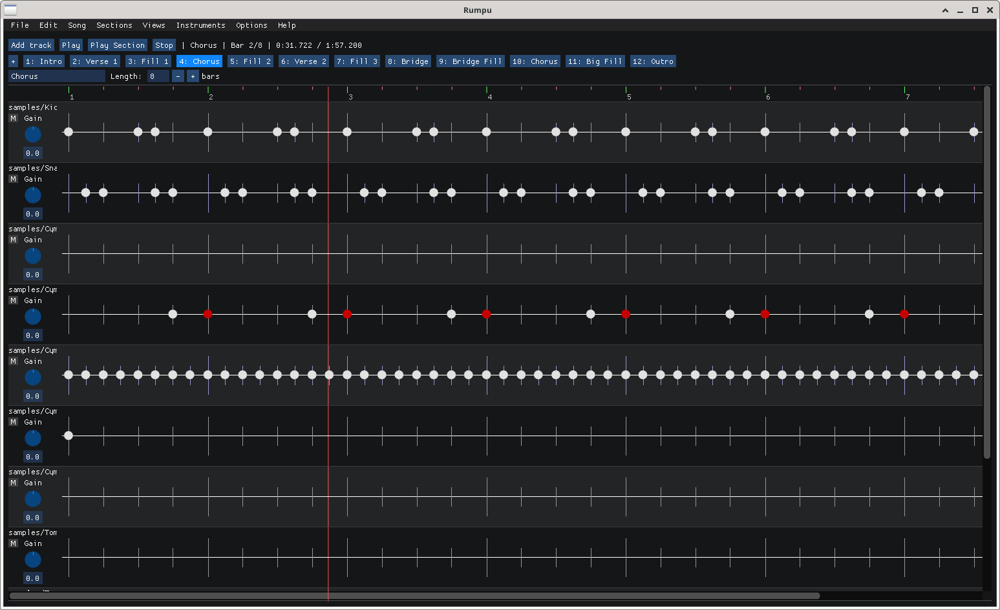
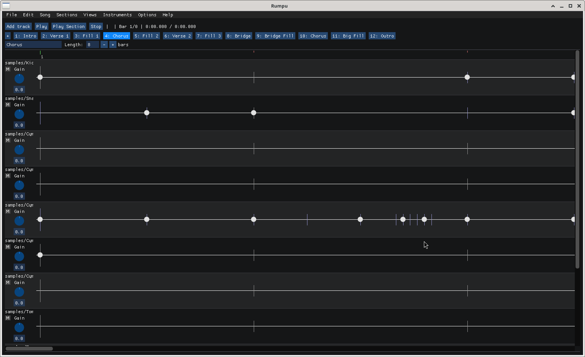

# Rumpu

**A desktop drum machine for composing songs from audio samples.**



Rumpu is a small native application for arranging drum songs out of WAV
samples. You build a song from *sections*, each section holds *tracks*, and
each track plays an *instrument* — a single WAV or a folder of WAVs that are
randomised per hit. Tempo, time signature, per-beat volume and timing offsets,
and choke groups are all editable on a zoomable timeline.

The project is **alpha software** (current version: 0.1.2). Expect rough edges.

## Features

**Songwriting**
- Songs built from reorderable, cloneable sections
- Multiple tracks per section, one instrument per track
- Tempo (BPM) and time signature changes between bars
- Pattern editor with bar division by any natural number
- Apply / clone patterns across sections

**Sound**
- Load any 16/24/32-bit WAV (mono or stereo) as an instrument
- Multi-sample instruments — drop a folder of WAVs and Rumpu randomises
  per hit
- Per-beat volume and timing-offset randomisation
- Choke groups so overlapping hits cut the previous one
- Per-track volume, mute, gain; volume slides

**I/O**
- `.spd` binary project files
- Batch WAV import
- 16-bit WAV export of the full song

**Platform**
- Linux (ALSA audio, GTK file dialogs)
- Windows (DirectSound audio, native file dialogs)

## Screenshots



*Pattern editor zoomed in on a bar*

## Getting started

Rumpu does **not** ship with any audio samples. Bring your own — any WAV file
will do. Plenty of free, redistributable drum sample packs are available
online; pick one you like and point Rumpu at the folder via
*Instruments → Add instruments from folder…*.

For a step-by-step walkthrough, see **[doc/MANUAL.md](doc/MANUAL.md)**.

## Building from source

Rumpu uses git submodules for ImGui, ImGui-Knobs, and Catch2. Clone with:

```sh
git clone --recursive <repo-url> rumpu
cd rumpu
```

If you already cloned without `--recursive`:

```sh
git submodule update --init --recursive
```

### Linux

Dependencies:

- A C++26 compiler (GCC 14+ or recent Clang)
- CMake ≥ 3.10
- OpenGL, GLFW
- GTK 3 development headers (file dialogs)
- ALSA development headers (`libasound2-dev` / `alsa-lib-devel`)

Build:

```sh
cmake -S . -B build
cmake --build build
./bin/rumpu
```

### Windows (cross-compile from Linux)

Requires the MinGW-w64 toolchain (`mingw64-gcc-c++` or equivalent).

```sh
./build-windows.sh                # builds build-windows/bin/rumpu.exe
./build-windows.sh --installer    # additionally produces an NSIS installer
```

The installer registers Rumpu's `.spd` file association on the target
system and bundles the user manual (reachable from the Start Menu). Building
the installer requires `pandoc` on the build host to render the manual.

### Command-line options

```
rumpu [project.spd]
  -o, --open <file>   open a project file
  -v, --version       print version
  -h, --help          show help
```

## Running tests

```sh
cmake -S . -B build_test
cmake --build build_test --target test_rumpu
./bin/test_rumpu
```

## Project layout

| Path | What's there |
|---|---|
| `rumpu/app/` | ImGui-based UI, dialogs, views |
| `rumpu/core/` | Song data structures, mixer, player, export, undo |
| `securepath/` | Logging, event loop, audio backend |
| `submodules/` | ImGui, ImGui-Knobs, Catch2 |
| `doc/` | Manual, design notes, screenshots |
| `test/` | Unit tests (Catch2) |
| `tools/` | Utility programs |

## License

MIT — see [LICENSE](LICENSE). Copyright © 2026 Secure Path Oy.

Created by Mikael Kilpeläinen.
