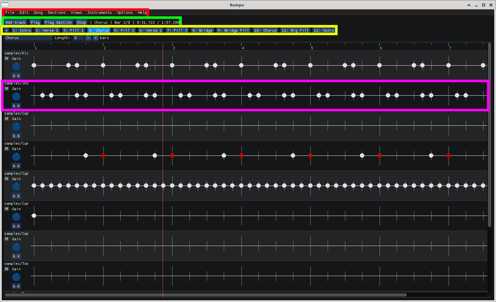
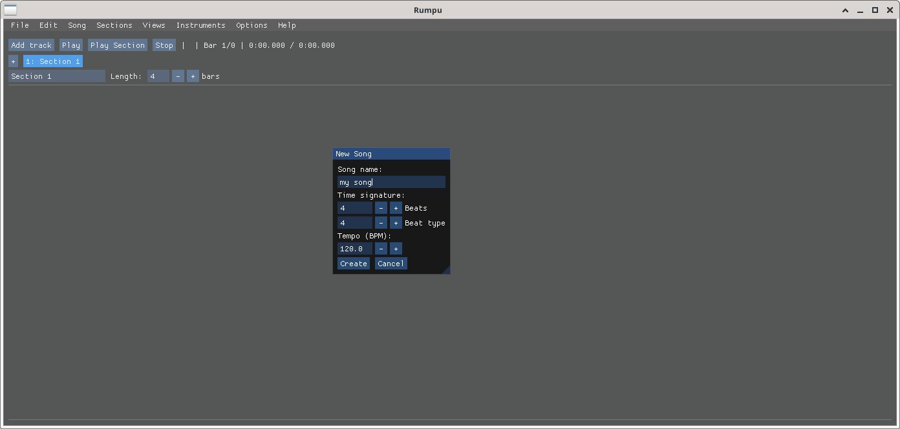
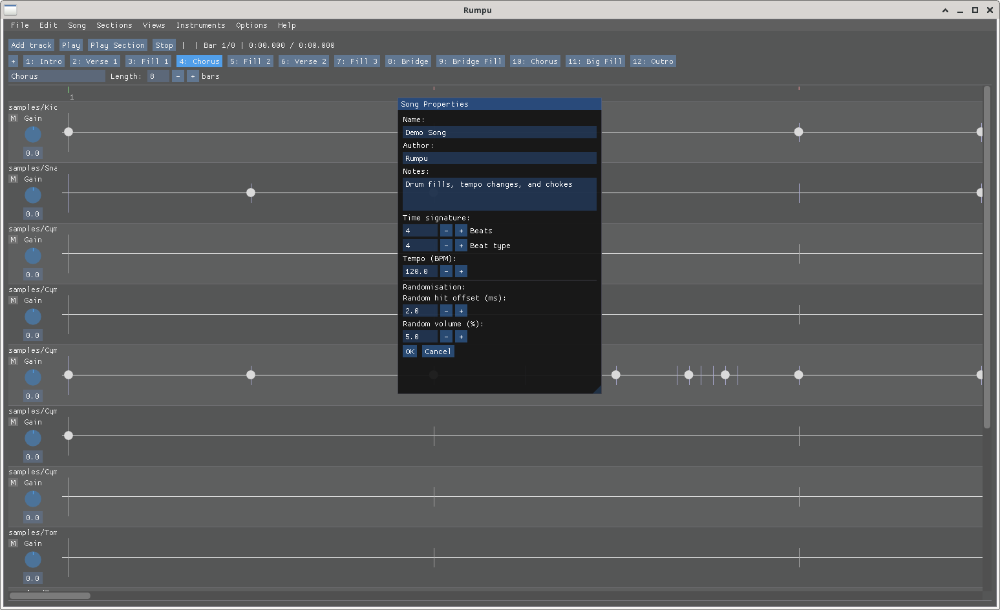
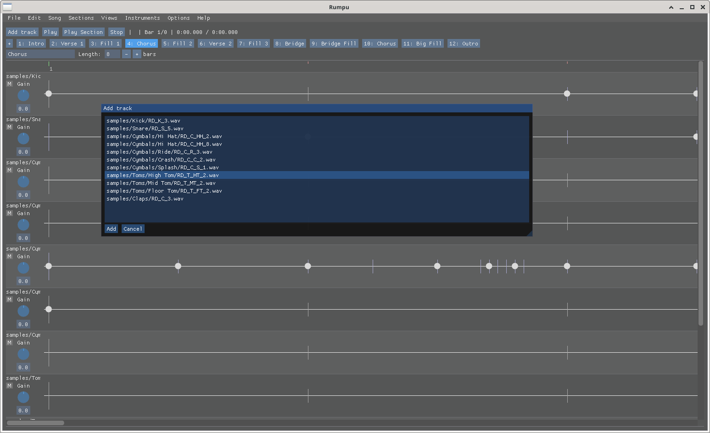
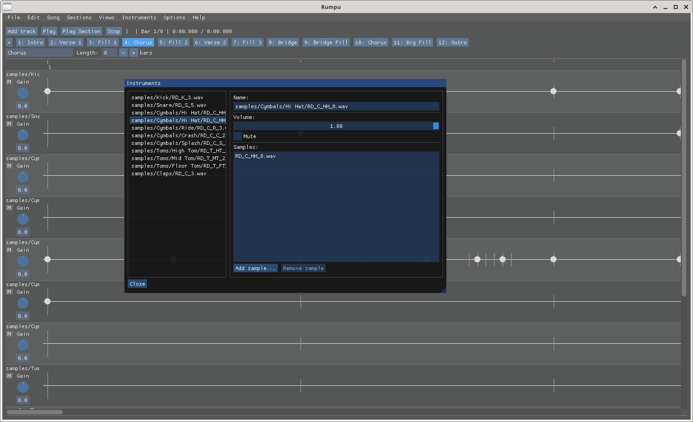
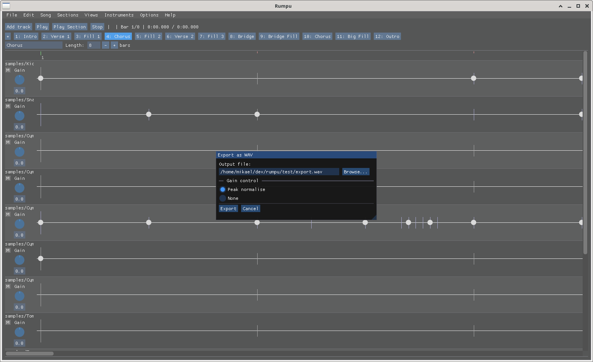

# Rumpu Manual

This is a basic guide for getting started with Rumpu. It covers the data
model, the main window, and the most common tasks: creating a song, adding
tracks, editing patterns, and exporting.

For build instructions see the [README](../README.md).

## 1. The Rumpu model

A **song** in Rumpu is a list of **sections** (the pieces you arrange — verse,
chorus, fill, etc.). Each section contains:

- a number of **bars** at a chosen **time signature** and **tempo**;
- one or more **tracks**.

Each track has a single **instrument** — either one WAV file or a folder of
WAVs that Rumpu picks from at random per hit (multi-sample). A track holds a
**pattern**: which beats are played, at what volume, with what randomisation.

Songs are saved as `.spd` files.

## 2. Main window

From top to bottom:

- **Menu bar** — File, Edit, Song, Sections, Views, Instruments, Options,
  Help.
- **Toolbar** — *Add track*, *Play*, *Play Section*, *Stop*, plus a position
  readout showing bar number and time elapsed.
- **Section list / view** — the current section's bars, with the play cursor
  during playback.
- **Track pane** — one row per track; the track edit view shows the
  beat-level pattern.

You can toggle individual views from the **Views** menu.

## 3. Bringing your own samples

Rumpu doesn't ship with WAV samples. Use any 16/24/32-bit WAV files (mono or
stereo). Many free, redistributable drum sample packs exist online — collect
the ones you want into a folder and you're ready.

## 4. Creating your first song

**File → New Song** opens the New Song dialog.

Set the song name, BPM, and time signature, then confirm. You'll get an empty
section to start arranging in.

You can change song-wide properties later from **Song → Properties…**.

## 5. Playback

- **Play** plays the whole song from the start.
- **Play Section** plays only the current section, looping back when it ends.
- **Stop** halts playback.
- **Options → Follow play cursor** keeps the view scrolled to the current
  position during playback.
- **Mouse wheel** zooms the timeline. The wheel is dedicated to zooming and
  does *not* scroll the view — this is intentional, to avoid accidental
  scrolling while editing.

## 6. Sections

Use the **Sections** menu to manage sections:

- **Clone section** duplicates the current section (handy for variations).
- **Remove section** deletes it (only available when more than one exists).
- The bottom of the menu lists all sections; pick one to switch to it.

Per-section properties — bar count, tempo, time signature — are edited in the
section info view.

Tempo and time signature can also change *between bars* inside a section.

## 7. Tracks and instruments

Click **Add track** in the toolbar (or use the Add Track dialog from the
menu). You can either:

- Pick a single WAV file as the instrument, or
- Pick a folder — every WAV in the folder becomes part of a multi-sample
  instrument, and Rumpu randomises which one plays per hit.

The **Instruments** menu also has:

- **Add instrument…** — register an instrument without binding it to a
  track yet.
- **Add instruments from folder…** — batch-import many instruments at once.
- **Manage instruments…** — review and remove instruments registered with
  the song.

### Choke groups

If two hits on the same track would overlap, the earlier sound is cut where
the next hit starts. This models real-world drum behaviour (a closed hi-hat
silencing an open one, for example) and keeps tightly-timed patterns clean.

## 8. The pattern editor

Each track row shows beats laid out across the section's bars. Click a beat
slot to toggle a hit. The primary hit of each bar is highlighted.

For finer rhythms you can divide a bar (or part of a bar) by any natural
number without changing the song's time signature — useful for triplets,
quintuplets, and similar.

Per-beat controls let you set:

- **Volume** for that single hit;
- **Random offset** — small ± timing jitter so the hit doesn't land exactly
  on the grid;
- **Random volume** — small ± volume variation per hit.

You can also apply patterns from one place to another, and clone sections to
re-use a groove with variations.

## 9. Mixing

For each track:

- **Volume** sets the steady level;
- **Mute** silences the track;
- **Gain** trims the input level of the instrument itself;
- **Volume slide** ramps the volume between bars (existing sounds keep
  their original level; new hits use the slid-down value).

Use the track header context menu to access track-level options.

## 10. Saving and loading

- **File → Save** / **Save As…** writes a `.spd` file.
- **File → Open…** loads one.
- On Windows, the installer registers `.spd` so double-clicking a project
  opens it in Rumpu.
- You can also pass a project on the command line:
  `rumpu my-song.spd` or `rumpu --open my-song.spd`.

## 11. Exporting to WAV

**File → Export…** renders the whole song to a 16-bit WAV file.

Choose the output file, then pick how the mix level is handled:

- **Peak normalise** scales the whole mix so its loudest peak reaches full
  scale — maximises level without clipping.
- **None** writes the mix at its rendered level, with no gain change.

## 12. Keyboard shortcuts

| Action | Shortcut |
|---|---|
| Undo | Ctrl + Z |
| Redo | Ctrl + Shift + Z |
| Zoom timeline | Mouse wheel |
| Close dialog | Esc |

Other actions are reachable through the menus and toolbar.

## 13. Known limitations

Rumpu is alpha software. Some things to be aware of:

- Undo/redo is experimental and may not cover every action.
- Only WAV samples are supported — no SF2, SFZ, or MIDI input.
- No built-in effects (reverb, EQ, compression). Process the exported WAV
  in your DAW or audio editor of choice.
- The UI layout is fixed; no detachable panels yet.

Bug reports and suggestions are welcome via the project's issue tracker.
